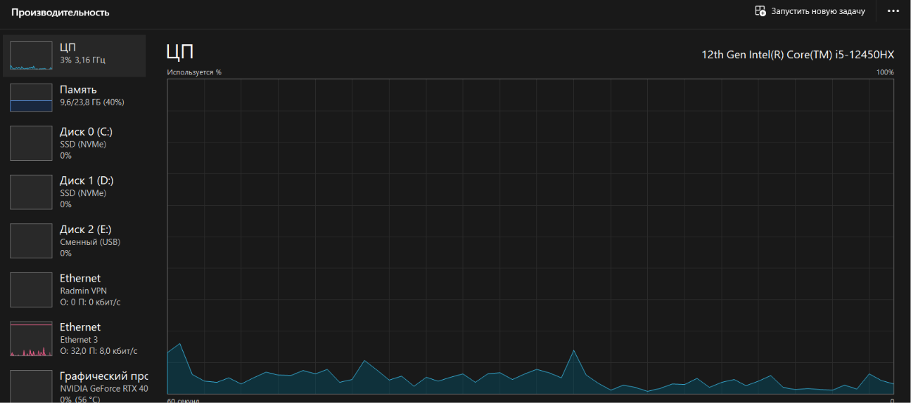
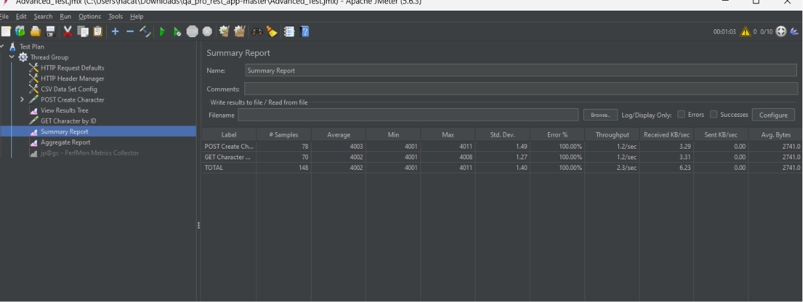

# Performance Testing Report (QA Pro REST App)

1. Objective:
To evaluate the performance and stability of the local Node.js server during user creation and data retrieval operations (POST and GET requests) using Apache JMeter.

2. Test Plan Configuration:
Thread Group:** 10 Threads (Users), Ramp-up period: 5 seconds.
Load Profile:**
  Scenario 1 (Basic Load):* 3 iterations (Loop Count: 3) resulting in 30 total POST/GET requests.
  Scenario 2 (Stress Test):* Continuous infinite load (Loop Count: Infinite) with a defined thread lifetime of 60 seconds.
Key Features:** POST request data was parameterized using a `CSV Data Set Config`. GET requests utilized correlation to dynamically fetch the `character_id` via a `JSON Extractor`.
3. Test Results (Scenario 1 - Basic Load):

Throughput: The server successfully processed all incoming requests without any bottlenecks.
Average Response Time:** ~0-1 ms (extremely fast response due to local environment execution).
Error Rate: 0.00% (100% of requests were successful).
4. Resource Monitoring (Scenario 2 - 60s Stress Test):

Observation:During the 60-second continuous stress test, CPU utilization remained exceptionally low (averaging below 10%). RAM consumption was stable with no memory leaks detected.
Technical Note: Due to strict Windows access privilege restrictions affecting the native `sigar` library within the `jp@gc - PerfMon` plugin (resulting in an `EXCEPTION_ACCESS_VIOLATION`), system resource monitoring was conducted using the built-in OS Task Manager, which provided accurate, real-time hardware telemetry.

5. Conclusions and Recommendations:
The REST application functions with absolute stability under the baseline load.
No architectural or performance bottlenecks were detected in the local environment.
Recommendations for Future Testing: To identify the actual breaking point of the application, it is highly recommended to deploy the application to a remote staging server (non-localhost) and conduct a true stress test with a significantly higher thread count (e.g., 100, 500, or 1000 concurrent users).